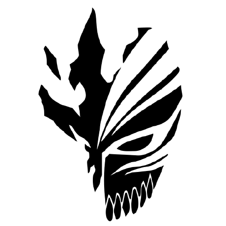

# Welcome to my profile ! 👋

## 🚀 Quick Summary

     
    5th year Web & Mobile Development Student @ <a href="https://www.estiam.education"> <b>Estiam</b></a> 
    Extended Reality Dev @ <a href="https://sncf.com/"> <b>SNCF</b></a> 
    JS • Unity C# • Industrial Internet of Things 
    3D Printing • CNC Manufacturing 
     

## 📖 My Mindset

Behind-the-scene technician, who loves to discover new tools and techs.  
Passionnate about IT, mainly development and CNC technologies.  
Always aiming to do things well, with a focus on learning and improving every day.

## 💻 Languages & Techs

- **JavaScript** :  

    
    
    
    
    
    
    
    
    
    
    

 

- **C# - Unity** :  

    
    
    
    
    

 
  
- **Java - Kotlin** :  

    
    
    
    
    

 
  
- **Relational DBs** :  

    
    
    

 
  
- **IDEs** :  

    
    
    

 
  
- **Version Control** :  

    
    
    
    
    

 
  
- **CI/CD - Deployment** :  

    
    
    
    
    

 
  
- **OS Administration** :  

    
    
    
    
    
    
    

 
  
- **Boards** :  

    
    
    
    

  
## 🏢 Team

People I mostly work with :

-  [@AssADev](https://github.com/AssADev)
-  [@Azzarim](https://github.com/Azzarim)
-  [@CLSigmaaa](https://github.com/CLSigmaaa)
