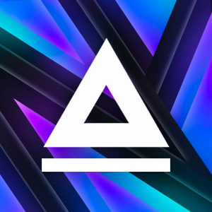

# Welcome to my profile ! 👋

## 🚀 Quick Summary

     
    3rd year IT Student @ <a href="https://www.estiam.education"> <b>Estiam</b></a> 
    Junior Dev @ <a href="https://sncf.com/"> <b>SNCF</b></a> 
    JS • C# • IOT • Software 
    3D Printing • CNC 
     

## 📖 My Mindset

Behind-the-scene technician, who loves to discover new tools and techs.  
Passionnate about IT, mainly software development and CNC technologies.  
Ambitious, expert and perfectionist as its core.

## 💻 Languages & Techs

-   **JavaScript** :  

    
    
    
    
    
    

-   **C#** :  

    
    
    

-   **Mobile** : 

    
    

-   **PHP** :  

    
    

-   **SQL** :  

    
    

-   **Java** :  

    

-   **Python** : 

    

-   **IDEs** :  

    
    
    
    

-   **Version Control** :  

    
    
    

-   **OS** :  

    
    
    
    
    
    
    

-   **Boards** :  

    
    

## 🏢 Team

People I mostly work with :

-    [@AssADev](https://github.com/AssADev)
